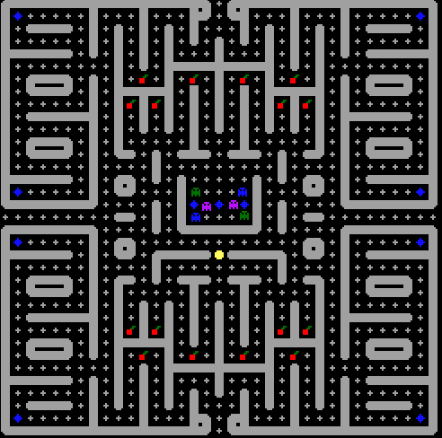
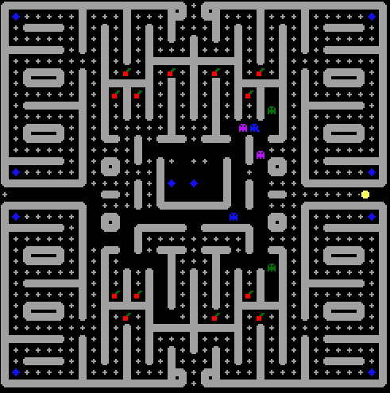
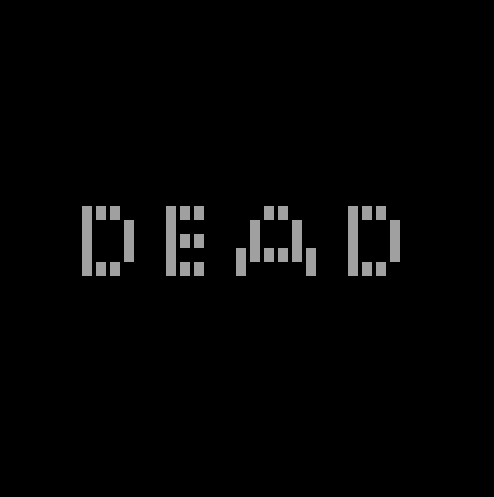

# Brief

Development of an Pacman game in MIPS microprocessor, using the MARS simulator and Bitmap display as graphical output.
It was the final project of the Microprocessors lecture at Federal Institute of Santa Catarina (IFSC), in the Electronic Engineering program, semester 2019-1.

Some screenshots:

# Requisitos do projeto

* Tempo de desenvolvimento: 1 mes
* **Movimentação e controle**
  * Pacman controlado pelas teclas AWSD (com bufferização)
  * Barra de espaço pausa o jogo
  * Movimentação automática dos oponentes
  * As bordas sem parede levam o PACMAN/inimigo para a borda oposta
* **Invencibilidade**
  * Ao comer a bolinha especial
  * Dura 30 segundos
  * Permite comer os inimigos
* **Pontuação**
  * Comida: 10pts
  * Cereja: 1000pts
  * Inimigo (comigo durante invencibilidade): 1000pts

# Inteligencia Artifical

* Cada fantasma é modelado como um agente inteligente solucionando um problema de busca semi informada (busca pelo pacman)
* O estado atual do fantasma é representado de forma fatorada (variáveis ponderadas de controle)
* **Ambiente do agente**
  
  * Parcialmente observável (apenas as linhas retas frontais e laterais, até encontrar uma parede)
  * Determinístico (ambiente compreensível pelo estado atual)
  * Multiagente, porem o fantasma evita interagir com outros agentes (apenas não esbarra com outros fantasmas)  
* **Programa do agente**
  
  * Agente reativo simples
* Percebe o estado atual e toma uma decisão
  

  
* **Movimentação do agente**
  * A cada iteração, o agente monitora seu ‘campo de visão’: linhas retas à frente e aos lados, até encontrar uma parede
  * Se ele ver o pacman, seu objetivo é ir na sua direção. Se não ver, continua se movendo da mesma direção
  * Se ver um fantasma na direção frontal, muda de direção aleatoriamente
  * Se encontrar uma parede, escolhe outra direção aleatoriamente

# Detalhes da implementação

* O sistema de pontuação não foi implementado

* O “IA” foi implementado apenas um VisualSearch na direção frontal, sem buscar o pacman

* Os agentes foram organizados me um array, de forma que podemos adicionar/remover mais oponentes com facilidade

  